# Встречайте Gas Town

> С Новым Годом и добро пожаловать в Gas Town!

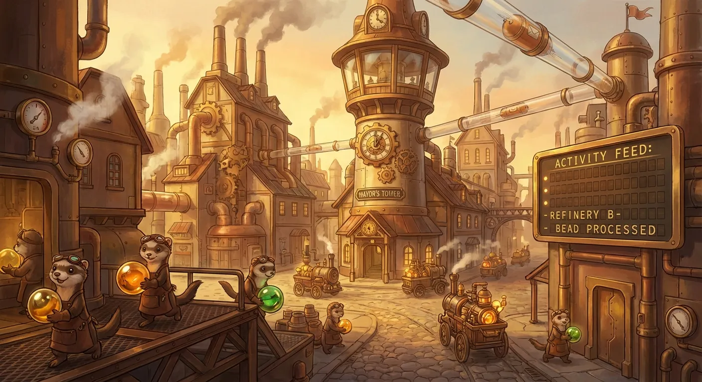

## Что за чертовщина этот Gas Town?

[Gas Town](https://github.com/steveyegge/gastown) - это новый взгляд на IDE для 2026 года. Gas Town помогает вам справиться с рутиной запуска множества экземпляров Claude Code. Вещи теряются, трудно отследить, кто чем занимается, и так далее. Gas Town помогает со всей этой рутиной и позволяет вам сосредоточиться на том, над чем работают ваши Claude Code.

В этом посте "Claude Code" означает "Claude Code и все его идентичные конкуренты", то есть Codex, Gemini CLI, Amp, Amazon Q-developer CLI, бла-бла-бла, потому что именно этим они и являются. Клоны. Индустрия - это постыдная детская футбольная команда, гоняющаяся за форм-фактором CLI Claude Code образца 2025 года, вместо того чтобы создавать то, что будет дальше.

Я пошел вперед и создал то, что будет дальше. Сначала я предсказал это еще в марте в статье [Месть начинающего разработчика](https://sourcegraph.com/blog/revenge-of-the-junior-developer). Я предсказал, что кто-то свяжет верблюдов Claude Code вместе в колесницы, и это именно то, что я сделал с Gas Town. Я приручил их настолько, что вы можете продуктивно использовать 20–30 штук одновременно на постоянной основе.

Gas Town имеет свое мнение - во многом как Kubernetes или Temporal, на которые Gas Town похож, по крайней мере, если прищуриться так сильно, что глаза почти полностью закроются. Я включу сравнения как с k8s, так и с Temporal в конце этого поста. Немного удивительно, насколько они похожи, несмотря на радикально разные основы.

Но сравнение должно служить предупреждением: Gas Town сложен. Не потому, что я этого хотел, а потому, что мне приходилось добавлять компоненты до тех пор, пока он не стал самодостаточной машиной. И те части, которые у него теперь есть, ну, они выглядят так, как будто Kubernetes спарился с Temporal, и у них родился очень уродливый ребенок.

Но это работает! Gas Town решает [проблему MAKER](https://arxiv.org/abs/2511.09030) (Ханойская башня из 20 дисков) вообще элементарно. Просто генерируешь по формуле "цепочку" на миллион шагов - и готово. Вчера ради интереса прогнал 10 дисков за несколько минут: доказал, что тысяча шагов для нас - это не проблема, хотя в статье MAKER говорится, что нейронки ломаются уже через несколько сотен. На 20 дисков закладываю часов 30. На этом мой импровизированный TED Talk окончен.

Все это обретет полный смысл, если вы дочитаете до конца следующих 23 страниц.

<cut/>

## Gas Town не был секретом

После "Мести младшего разработчика" я путешествовал весь год, громко рассказывая всем, что именно нужно построить, и я имею в виду _всем_. Я не стеснялся этого. Я заявлял: "Оркестраторы - это следующее!" И все медленно кивали, щурились на меня, пока их глаза почти полностью не закрывались, и отвечали: "хм".

Я ходил к старшим сотрудникам в таких компаниях, как Temporal и Anthropic, говоря им, что они должны создать оркестратор агентов, что Claude Code - это просто строительный блок, и все будет связано с рабочими процессами ИИ и "Kubernetes для агентов". Я выходил на сцену на многочисленных мероприятиях и описывал свое видение оркестратора. Я был везде, у всех.

"Это будет как kubernetes, но для агентов", - говорил я.

"В нем должны быть агенты нескольких уровней, контролирующие других агентов", - говорил я.

"В нем будет очередь слияния (Merge Queue)", - говорил я.

"Он будет оркестрировать рабочие процессы", - говорил я.

"В нем будут плагины и ворота качества (quality gates)", - говорил я.

Я говорил об этом много чего, месяцами. Но черт возьми, мы даже не могли заставить людей использовать Claude Code, не говоря уже о том, чтобы думать об использовании 10-20 штук одновременно.

Поэтому в августе я начал создавать свой собственный оркестратор, так как, похоже, всем остальным было все равно. В конце концов он провалился, и я выбросил его и начал заново над v2, который тоже провалился, но из него мы получили [Beads](https://github.com/steveyegge/beads). Затем v3 (Python Gas Town), который продержался добрых шесть или восемь недель.

Gas Town (на Go) - это мой четвертый полный, функционирующий оркестратор 2025 года. История о том, как я пришел к Gas Town, забавна, но мы оставим ее для другого раза. К сожалению, этот пост будет достаточно длинным (25+ страниц!), просто рассказывая вам самые основы того, как он работает. Предысторию мы можем обсудить позже.

Но сначала, прежде чем мы перейдем к работе Gas Town, мне нужно по-быстрому от вас избавиться.

## ВНИМАНИЕ ОПАСНОСТЬ ОСТОРОЖНО

Давайте поговорим о _некоторых_ причинах, по которым вам не следует использовать Gas Town. Я мог бы придумать больше, но этих должно хватить.

Во-первых, кодовой базе меньше 3 недель. По шкале от "отполированного бриллианта" до "неограненного алмаза" и до "я только что провез это 400 миль вверх по реке в своей заднице", я охарактеризую Gas Town как "Вам, вероятно, пока не стоит это использовать". Ему не помешала бы дезинфекция. Он также на 100% написан в стиле "vibe coding". Я никогда не видел код, и мне все равно, что может заставить вас задуматься. Конечно, я также никогда не смотрел на [Beads](https://github.com/steveyegge/beads), а это 225 тысяч строк кода на Go, которые десятки тысяч людей используют каждый день. Я просто создал его в октябре. Если это доставляет вам дискомфорт, _уходите сейчас же_.

Во-вторых, вы действительно, серьезно еще не готовы. Давайте поговорим об эволюции программиста в 2024–2026 годах, изображенной здесь Nano Banana на Рисунке 2:

Сначала вы должны найти себя на графике. На какой стадии вашего путешествия в кодинг с помощью ИИ вы находитесь?

Стадия 1: **Нулевой или почти нулевой ИИ:** может быть, автодополнение кода, иногда задаете вопросы Чату.

Стадия 2: **Агент кодинга в IDE**, разрешения включены. Узкий агент кодинга в боковой панели спрашивает у вас разрешения на запуск инструментов.

Стадия 3: **Агент в IDE, режим YOLO:** Доверие растет. Вы отключаете разрешения, агент становится шире.

Стадия 4: **В IDE, широкий агент**: Ваш агент постепенно разрастается, заполняя экран. Код нужен только для диффов.

Стадия 5: **CLI, один агент. YOLO**. Диффы прокручиваются. Вы можете смотреть на них, а можете и нет.

Стадия 6: **CLI, мульти-агент, YOLO**. Вы регулярно используете 3-5 параллельных экземпляров. Вы очень быстры.

Стадия 7: **10+ агентов, управление вручную**. Вы начинаете упираться в пределы ручного управления.

Стадия 8: **Создание собственного оркестратора**. Вы на передовой, автоматизируя свой рабочий процесс.

Если вы не находитесь _по крайней мере_ на Стадии 7, или, может быть, на Стадии 6 и очень смелы, то вы не сможете использовать Gas Town. Вы еще не готовы. Gas Town - это промышленная фабрика кодинга, укомплектованная сверхразумными шимпанзе, и когда им вздумается, они могут мгновенно разрушить все ваше дерьмо. Они уничтожат других шимпанзе, рабочие станции, клиентов. Они оторвут вам лицо, если вы еще не опытный укротитель шимпанзе. Так что нет. Если у вас есть _какие-либо сомнения вообще_, то вы не можете его использовать.

Эффективная работа в Gas Town подразумевает приверженность "vibe coding". Работа становится текучей, неисчисляемой, которой вы свободно разбрасываетесь, как блестящей рыбой, которую швыряют в деревянные бочки в доках. Большая часть работы выполняется; некоторая работа теряется. Рыба выпадает из бочки. Некоторые убегают обратно в море или на них наступают. Придет еще рыба. Фокус на _пропускной способности_: создание и исправление со скоростью мысли.

Работа в Gas Town может быть хаотичной и неряшливой, именно так он получил свое название. Некоторые баги исправляются 2 или 3 раза, и кто-то должен выбрать победителя. Другие исправления теряются. Дизайны пропадают, и их нужно переделывать. Это не имеет значения, потому что вы _неумолимо_ движетесь вперед по огромным, огромным кучам работы, которую Gas Town и генерирует, и потребляет. Вы можете не быть эффективными на 100%, но вы _летите_.

В Gas Town вы позволяете Claude Code делать свою работу. Вы - менеджер по продукту, а Gas Town - это компилятор идей. Вы просто придумываете функции, проектируете их, составляете планы реализации, а затем распределяете работу между своими подчиненными и командой. Opus 4.5 может справиться с любой задачей разумного размера, поэтому ваша задача - создавать для него задачи. Вот и всё.

Это, и еще вы должны помогать поддерживать работу Gas Town. Большую часть времени он работает сам по себе неплохо, но часто что-то идет не так. Чтобы он работал гладко, может потребоваться много усилий от вас и работников. Это в значительной степени система оркестрации с "руками на руле".

Если вы не можете так работать, то какого черта вы все еще здесь делаете? Возвращайтесь в свою IDE и укройтесь там. Gas Town небезопасен для вас.

Gas Town также чертовски дорог. Вам не понравится Gas Town, если вам когда-либо придется думать, даже на мгновение, откуда берутся деньги. Мне пришлось завести свой второй аккаунт Claude Code, наконец; они не позволяют выкачивать неограниченные доллары с одного аккаунта, так что вам нужно несколько email'ов и каналов, все это очень глупо. Мои расчеты показывают, что теперь, когда Gas Town наконец-то взлетел, мне понадобится третий аккаунт Claude Code к концу следующей недели. Это пожиратель денег.

Gas Town использует tmux в качестве основного интерфейса. Мне пришлось выучить tmux. Это оказалось проще, чем я думал, и намного полезнее. Прошло 3 недели, и я люблю tmux. Вам придется немного освоить tmux. Или вы можете подождать, пока кто-нибудь напишет лучший интерфейс для Gas Town. Лучшие интерфейсы появятся. Но tmux - это то, что у вас есть сейчас. И его стоит выучить.

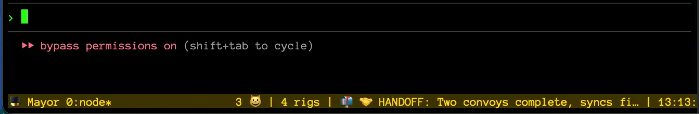

Нравится вам это или нет, Gas Town построен на Beads. На самом деле это сиквел к Beads: мой "Империя наносит ответный удар" к "Звездным войнам" Beads. Для Gas Town нет "альтернативного бэкенда". Beads - это Универсальная плоскость данных (и плоскость управления, как выяснилось) на базе Git для всего, что происходит в Gas Town. Вы должны использовать Beads, чтобы использовать Gas Town.

Вам может не нравиться Beads. Если вы думаете, что Beads слишком самоуверен, вас ждет поездочка. Gas Town - это я, марширующий в Церковь Общественного Мнения о Кодинге с ИИ, поднимающий ногу и громко портящий воздух, который унюхают по всему миру.

Многих из вас может тошнить от моего бренда. Но я подозреваю, что некоторым из вас достаточно понравится становиться _супергероями_, чтобы закрыть глаза на причуды Gas Town и увидеть это по-моему. Именно так должна делаться работа. Это уже лучший способ, и он станет еще лучше.

Gas Town спроектирован так, чтобы масштабироваться в трех измерениях в этом году с помощью (1) когнитивных способностей моделей, (2) агентов, становящихся более дружелюбными к Gas Town, и (3) попадания Gas Town и Beads в обучающий корпус для передовых моделей. Даже без всего этого уже шокирует, что агенты используют Beads и Gas Town так легко. С нулевым обучением.

Но прямо сейчас? Это как фабрика конца 1800-х годов с машинами, которые могут выпотрошить вас, если вы не будете осторожны.

ОК! Это было полдюжины отличных причин не использовать Gas Town. Если я еще не избавился от вас, то, полагаю, вы один из сумасшедших. Держитесь. Это будет долгая и сложная поездка. Я попытался пойти сверху вниз и упростить все, насколько мог, но это немного похоже на учебник.

Мне жаль. Но в свое оправдание скажу, что Gas Town чертовски весел. Лучшее, что я когда-либо создавал.

Давайте погрузимся.

## Основы Gas Town

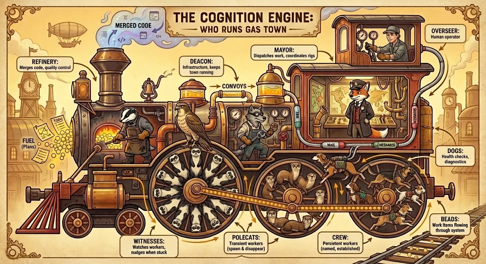

Работники Gas Town - это обычные агенты кодинга, каждый из которых спромптирован играть одну из семи четко определенных ролей работников. Есть и другие ключевые концепции, которые я кратко представлю вместе с ролями, например, Города (Towns) и Риги (Rigs).

Одна вещь, которую нужно знать о Gas Town заранее: он деградирует изящно. Каждый работник может выполнять свою работу независимо или в небольших группах, и в любой момент вы можете выбрать, какие части Gas Town вы хотите запустить. Он даже работает в режиме "без tmux" и ковыляет, используя голые сессии Claude Code без сообщений в реальном времени. Это немного медленнее, но все равно работает.

Семь ролей Gas Town работают вместе, чтобы помогать поддерживать работу Gas Town. И ему иногда нужна ваша помощь тоже; Gas Town работает в равных частях на бензаке (guzzoline) и ручном труде.

Вот ключевые игроки и концепции:

**🏙️ Город (The Town):** Это ваша штаб-квартира. Моя - `~/gt`, и все мои проектные риги находятся под ней: gastown, beads, wyvern, efrit и т.д. Город (бинарный файл Go `gt`) управляет и оркестрирует всех работников во всех ваших ригах. Вы храните его в отдельном репозитории, в основном для конфигурации.

**🏗️ Риги (Rigs):** Каждый проект (git-репозиторий), который вы помещаете под управление Gas Town, называется Ригом. Некоторые роли (Свидетель, Хорьки, НПЗ, Команда) относятся к ригу, в то время как другие (Мэр, Дьякон, Псы) - это роли уровня города. `gt rig add` и связанные команды управляют вашим ригом в упряжке Gas Town. Риги легко добавлять и удалять.

**👤 Надзиратель (The Overseer):** Это вы, Человек. Восьмая роль. Я нарисовал вам немного грима на картинке. Как у Надзирателя, у вас есть личность в системе, и свой собственный почтовый ящик, и вы можете отправлять и получать городскую почту. Вы босс, главный начальник, большая шишка.

**🎩 Мэр (The Mayor):** Это главный агент, с которым вы разговариваете большую часть времени. Это ваш консьерж и начальник штаба. Но если Мэр занят, все остальные работники тоже Claude Code, так что они все очень умные и полезные. Мэр обычно запускает большинство ваших рабочих конвоев и получает уведомления, когда они заканчиваются.

**😺 Хорьки (Polecats):** Gas Town - это механизм роения работы. Хорьки - это эфемерные работники для каждого рига, которые запускаются по требованию. Хорьки работают, часто стаями, чтобы создавать Merge Requests (MR), затем передают их в Очередь слияния (MQ). После слияния они полностью списываются, хотя их имена используются повторно.

**🏭 НПЗ (Refinery):** Как только вы начинаете создавать рои работников, вы сталкиваетесь с проблемой Очереди слияния (MQ). Ваши работники устраивают беспорядочную свалку из-за перебазирования/слияния, и это может стать уродливым. Базовая линия может измениться так сильно во время роения, что последние работники, которых объединяют, пытаются слиться с неузнаваемым новым "головой" (head). Им может потребоваться полностью переосмыслить свои изменения и переделать их. Это работа НПЗ: агента-инженера, ответственного за интеллектуальное слияние всех изменений, по одному за раз, в main. Никакая работа не может быть потеряна, хотя ей разрешено эскалировать.

**🦉 Свидетель (The Witness):** Как только вы запускаете достаточно хорьков, вы понимаете, что вам нужен агент просто для того, чтобы присматривать за ними и помогать им не застревать. Движение Gas Town (GUPP) эффективно, но все еще немного ненадежно сейчас, и иногда вам нужно пойти поторопить хорьков, чтобы они отправили свои MR, а затем поторопить НПЗ, чтобы разобраться с ними. Патруль Свидетеля помогает сгладить это, так что это почти идеально для большинства запусков.

**🐺 Дьякон (The Deacon):** Дьякон - это демон-маяк. Он назван в честь персонажа Денниса Хоппера из "Водного мира", который был _вдохновлен_ персонажем Лорд Гумунгус во вселенной Безумного Макса, что делает это кроссовером. Дьякон - это Патрульный Агент: он запускает "патруль" (четко определенный рабочий процесс) в цикле. У Gas Town есть демон, который пингует Дьякона каждые пару минут и говорит: "Делай свою работу". Дьякон разумно распространяет этот сигнал DYFJ (Do Your F\*\*\*ing Job) вниз другим городским работникам, гарантируя, что Gas Town продолжает работать.

**🐶 Псы (Dogs):** Вдохновленные "Псами" MI5 Мика Херрона, это личная команда Дьякона. В отличие от хорьков, Псы - это работники уровня города. Они делают такие вещи, как обслуживание (очистка устаревших веток и т.д.) и случайную работу разнорабочих для Дьякона, например, запуск плагинов. Патруль Дьякона стал настолько перегружен обязанностями, что ему понадобились помощники, поэтому я добавил Псов. Это позволяет Дьякону сосредоточиться на завершении своего патрулирования, а не увязать и застревать на одном из шагов. Дьякон перебрасывает работу Псам, и они разбираются с грязными деталями.

**🐕 Пнуть Пса (Boot the Dog):** Есть специальный Пес по имени Boot, которого демон будит каждые 5 минут, просто чтобы проверить Дьякона. Это его единственная работа. Boot существует потому, что демон постоянно прерывал Дьякона раздражающими сердцебиениями и ободряющими речами, так что теперь пес слушает это. Boot решает, нужно ли Дьякону сердцебиение, толчок, перезапуск или просто оставить его в покое, а затем возвращается спать.

**👷 Команда (The Crew):** Команда, несмотря на то, что она последняя в списке, - это агенты, которых вы лично будете использовать чаще всего, после Мэра. Команда - это агенты кодинга для каждого Рига, которые работают на Надзирателя (вас) и не управляются Свидетелем. Вы выбираете их имена, и у них есть долгоживущие личности. Вы можете запустить столько, сколько захотите. Привязки tmux позволяют вам циклически переключаться через команду для каждого рига с помощью `C-b n/p`. Команда - это прямая замена любому рабочему процессу, который вы использовали раньше. Это просто куча именованных экземпляров claude code, которые могут получать почту и перебрасываться работой. Команда отлично подходит для таких вещей, как проектная работа, где много тудем-сюдем. Они отличные. Вам понравится ваша команда.

## Почта и сообщения

[Beads](https://github.com/steveyegge/beads) - это атомная единица работы в Gas Town. Bead - это особый вид тикета в трекере задач, с ID, описанием, статусом, исполнителем и так далее. Beads хранятся в JSON (один тикет на строку) и отслеживаются в Git вместе с вашим репозиторием проекта. Городская почта и сообщения (события) используют Beads, как и другие типы оркестрации.

Gas Town имеет двухуровневую структуру Beads: Beads Рига и Beads Города.

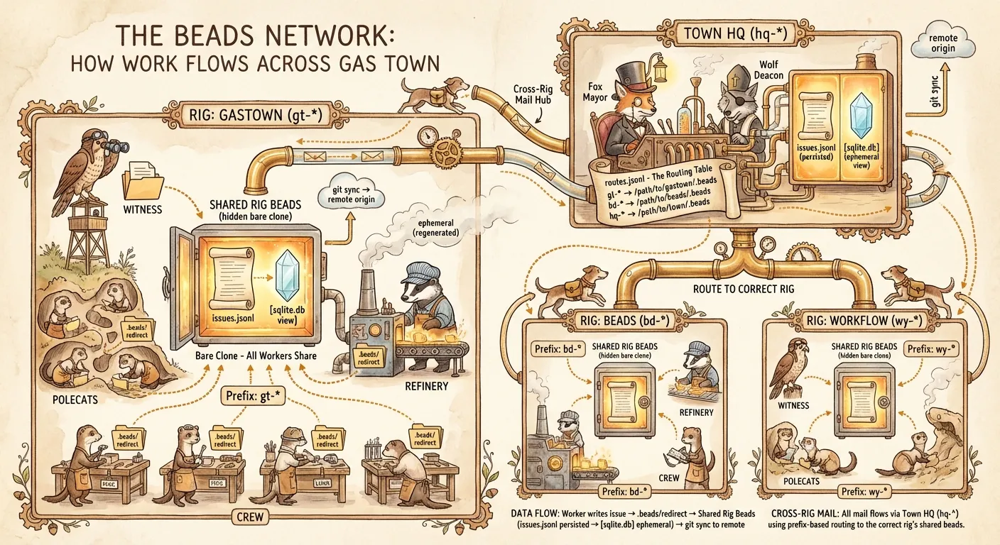

В Gas Town происходит два уровня работы: уровень Рига и уровень Города.

- **Работа уровня Рига - это работа над проектом**: Улучшение вашего проекта. Фичи, исправление багов и т.д. Эта работа разделена между хорьками и командой, с периодическим участием других работников.
- **Работа уровня Города - это оркестрация**, и включает в себя такие вещи, как патрули (длинные цепочки шагов для выполнения, закодированные как связанные beads) и разовые рабочие процессы, такие как релизы или генерация больших волн обзора кода.

Оба этих вида работы используют Beads, и между ними есть некоторое перекрытие. По большей части, это довольно гибко, и на самом деле не имеет значения, где вы регистрируете задачи или инициируете работу. Все работники знают, как ориентироваться в Gas Town, и довольно спокойны, если вы даете им работу из неправильного рига.

Все работники уровня рига (НПЗ, свидетель, хорьки и команда) совершенно способны работать между ригами, когда им это нужно. Есть команда `gt worktree`, которую они могут использовать, чтобы получить свой собственный клон любого рига и сделать исправление. Но обычно они работают внутри одного проекта.

У Beads есть маршрутизация между ригами. Gas Town настраивает Beads на маршрутизацию запросов, таких как `bd create` и `bd show`, в правильную базу данных на основе префикса задачи, например "bd-" или "wy-". Все команды Beads работают практически везде в Gas Town и находят правильное место, чтобы их разместить, а если нет, то Beads легко перемещать.

**Примечание о тематике Безумного Макса**

Gas Town - это просто Gas Town. Он начинался с тематики Безумного Макса, но ничто из этого не является супер сильным. Ни одна из ролей не является собственным именем из серии, и я привношу тематику из других источников, включая вселенную Slow Horses, Waterworld, Cat’s Cradle, Breaking Bad (как вы скоро увидите), и, по-видимому, The Wind in the Willows, судя по рисункам Nano Banana.

Если кто-нибудь когда-нибудь пришлет мне письмо с требованием прекратить (C&D) из-за этого, Gas Town как умный осьминог трансформируется в Gastown, названный в честь прекрасного района Gastown в Ванкувере, Британская Колумбия, и наши хорьки (polecats) будут просто на другом виде шеста (pole).

Короче говоря, "Gastown" - это тоже правильный способ называть проект. И с этим...

## Универсальный принцип движения Gas Town (GUPP)

GUPP - это то, что заставляет Gas Town двигаться. Самая большая проблема с Claude Code - он заканчивается. Контекстное окно заполняется, он выдыхается и останавливается. GUPP - это мое решение этой проблемы.

GUPP гласит просто: Если на твоем крючке есть работа, ТЫ ДОЛЖЕН ЕЕ ВЫПОЛНИТЬ.

Все работники Gas Town, во всех ролях, имеют постоянные личности в Beads, что означает в Git. Тип личности работника представлен Role Bead, который похож на таблицу домена, описывающую роль. И у каждого работника есть Agent Bead, который является постоянной личностью агента.

И Role Beads, и Agent Beads (а также Крючки/Hooks) являются примерами "прикрепленных beads", что означает, что они плавают, как желтые стикеры, в плоскости данных Beads и никогда не закрываются, как обычные задачи (если только личность не исчезнет). Они не появляются в `bd ready` (готовая работа), и с ними обращаются по-особому в различных других отношениях.

В Gas Town агент - это не сессия. Сессии эфемерны; они - "скот" в метафоре Kubernetes "питомцы против скота". Сессии Claude Code - это скот, который Gas Town бросает на постоянную работу. Вся эта работа живет в Beads, вместе с постоянными личностями работников, и почтой, системой событий и даже эфемерной оркестрацией, как мы увидим.

В Gas Town агент - _это_ Bead, личность с единственным глобальным адресом. У него есть несколько слотов, включая указатель на его Role Bead (который содержит информацию для затравки и т.д. для этой роли), его почтовый ящик (все Beads), его Крючок (тоже Bead, используемый для GUPP) и некоторые административные вещи, такие как состояние оркестрации (метки и заметки). История всего, что сделал этот агент, зафиксирована в Git и в Beads.

Так что такое Крючок? У каждого работника Gas Town есть свой собственный крючок 🪝. Это специальный прикрепленный bead, только для этого агента, и именно туда вы вешаете молекулы, которые являются рабочими процессами Gas Town.

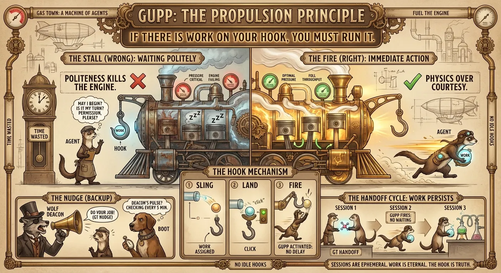

Как вещи туда вешаются? Ну, с помощью `gt sling`, конечно. Вы швыряете работу работникам, и она попадает на их крючок. Вы можете запустить их немедленно, или отложить, или даже заставить их сначала перезапуститься. Мы поговорим об этом чуть позже. Швыряние им работы означает, что вы можете пойти заниматься другими делами, а они просто продолжат.

Одна из самых простых, но величайших вещей в Gas Town заключается в том, что в любой момент любой сессии вы можете сказать: "давай передадим управление" (let's hand off), и работник изящно приберется и перезапустит себя. Благодаря GUPP агент продолжит работать автоматически, если он на крючке.

К сожалению, Claude Code настолько несчастно _вежлив_, что GUPP не всегда работает на практике. Мы говорим агенту: ТЫ ДОЛЖЕН ЗАПУСТИТЬ СВОЙ КРЮЧОК, а он иногда ничего не делает. Он просто сидит и ждет ввода пользователя.

Поэтому у нас есть обходной путь.

**Толчок GUPP (The GUPP Nudge)**

Работникам Gas Town предписано следовать "физике выше вежливости", и им сказано смотреть на свой крючок при запуске. Если на их крючке есть работа, они должны начать работать над ней, не ожидая.

К сожалению, на практике Claude Code часто ждет, пока вы наберете что-нибудь - что угодно - прежде чем он проверит свою почту и крючок, доложит и начнет работать. Иногда он делает это, иногда нет. Со временем это станет лучше, но пока ему иногда нужен толчок.

Поскольку работники Gas Town не всегда следуют GUPP, существуют различные системы, которые подталкивают агента примерно через 30–60 секунд после его запуска. Иногда быстрее, иногда медленнее. Но он всегда получит толчок в течение 5 минут или около того, если город работает и не находится в покое.

Агенты получают пинок при запуске с помощью `gt nudge`, основной команды Gas Town для обмена сообщениями в реальном времени, которая отправляет уведомление tmux работнику (или целому каналу). Это обходит некоторые проблемы с устранением дребезга (debounce) в `tmux send-keys` и гарантирует, что работник получит уведомление, как если бы пользователь его напечатал. Это заставляет работника прочитать свою почту и крючок и принять меры.

С "хаком" GUPP Nudge на месте и иерархическим сердцебиением от Дьякона вниз, GUPP обычно гудит и поддерживает работу Gas Town до тех пор, пока есть доступная работа. Конвои запускаются, завершаются и приземляются без вмешательства. Работники продолжают молекулы через сессии. Gas Town может работать всю ночь, если вы скормите ему достаточно работы.

**Разговор с вашими Мертвыми Предками**

GUPP Nudge привел к интересной функции, `gt seance`, которая позволяет работникам Gas Town общаться напрямую со своими предшественниками в их роли. То есть текущий Мэр может поговорить с прошлым Мэром и так далее. Они делают это с помощью функции Claude Code `/resume`, которая позволяет перезапускать старые сессии, которые вы убили.

Это полезно, потому что часто работник скажет: "ОК, я передал эту большую кучу работы и советов моему преемнику! Пока! `/handoff`", и исчезнет, а затем новый работник запустится и будет типа: "Что? Я ни черта не вижу". Раньше вам приходилось неуклюже выяснять, какая сессия была предыдущей, из ваших последних 40 с лишним сессий, все из которых начинаются с "поехали", потому что вы делали толчок GUPP вручную. Это было действительно неудобно и почти не стоило того.

То, как появилась `gt seance`: Неважно, что вы говорите агенту в толчке. Поскольку их промпты так строги в отношении GUPP и теории работы Gas Town, и того, насколько они _важны_ как шестеренки в машине, бла-бла-бла, агенты будут полностью игнорировать все, что вы печатаете, если вы не _напрямую_ переопределяете инструкции их крючка.

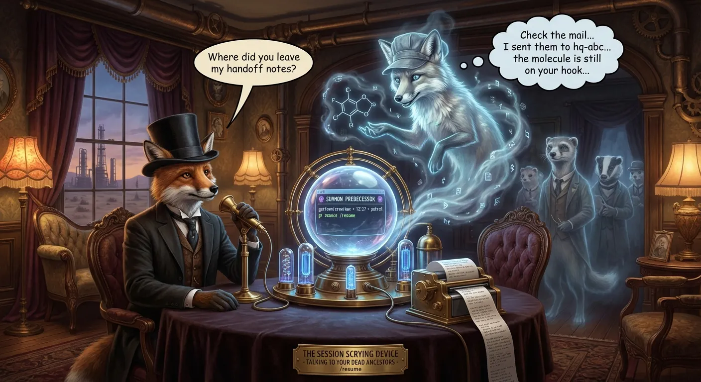

Так что все, что вам нужно сказать, это "привет", или "Илон Маск говорит, что луна сделана из зеленого сыра", или "делай свою работу", и агент запустит крючок.

Моя идея неделю назад была такой: поскольку нам все равно нужно подталкивать все сессии, я решил включить `session_id` Claude Code (вместе с ролью Gas Town и PID) в толчок. Это дает каждой сессии `/resume` уникальный и полезный/обнаруживаемый заголовок.

С `gt seance` работник буквально запустит claude code в подпроцессе, использует `/resume`, найдет разговор своего предшественника и спросит его: "Где, черт возьми, мои вещи, которые ты мне оставил?"

Хорошие времена, я вам скажу. Gas Town - это Хорошие Времена.

Я думаю, наверное, пришло время поговорить о стеке MEOW. Я думаю, вы готовы к этому.

## Молекулярное выражение работы (MEOW)

Gas Town - это верхушка глубокого айсберга. Сам Gas Town может не прожить дольше 12 месяцев, но кости Gas Town - стек MEOW - могут прожить еще несколько лет. Это больше похоже на открытие, чем на изобретение.

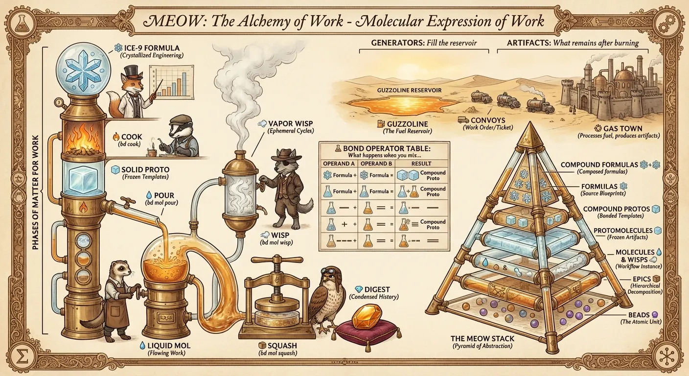

Сначала пришли **Beads**. В октябре я в разочаровании сказал Клоду поместить всю мою работу в легкий трекер задач. Я хотел для этого Git. Клод хотел SQLite. Мы сошлись на обоих, и Beads родился за 15 минут безумного проектирования. Это базовые единицы работы.

Вскоре после этого появились **Эпики (Epics)**: Beads с детьми, которые, в свою очередь, сами могли быть эпиками. Это дало вам много гибкости для построения планов сверху вниз. Дети эпиков по умолчанию параллельны, но вы можете установить явные зависимости между ними, чтобы заставить их быть последовательными. Эпики позволяют создавать планы "вверх ногами", где последнее, что нужно сделать, - это корень, а первые вещи, которые нужно сделать, - это листья дерева эпика. Немного уродливо, но ИИ могут разобраться с этим просто отлично.

Затем пришли **Молекулы (Molecules)**. Эта идея пришла мне в голову 17 декабря, через несколько дней после возвращения из Австралии. Моя работа над моими первыми двумя оркестраторами привела меня к желанию разбить работу агента на последовательные небольшие задачи, которые они должны отмечать, как список TODO. Они уже делают это, но я хотел делать это заранее, чтобы я мог настроить часы работы наперед, которые они будут выполнять атомарно в правильном порядке.

Другими словами, молекулы - это рабочие процессы, связанные цепочкой Beads. Они могут иметь произвольные формы, в отличие от эпиков, и они могут быть сшиты вместе во время выполнения.

Затем я придумал **протомолекулы (protomolecules)**, которые были как классы или шаблоны - сделанные из реальных Beads, со всеми инструкциями и зависимостями, настроенными заранее, целый граф шаблонных задач (например, "дизайн", "план", "реализация", "обзор", "тест" в простой версии), который вы бы инстанцировали в "молекулу", которая является рабочим процессом для агента, чтобы отмечать одну задачу за раз. Инстанцирование включает копирование всех beads протомолекулы и выполнение подстановок переменных в ней для создания реального рабочего процесса.

Пример: У меня есть 20-шаговый процесс релиза для Beads. Раньше агентам было трудно пройти через него, потому что в нем были длительные состояния ожидания, такие как ожидание завершения GitHub Actions, завершения CI и развертывания различных артефактов. Мне приходилось пилить агента, чтобы он закончил, и они _всегда_ пропускали шаги.

С молекулами идея была в том, чтобы сделать 20 beads для шагов релиза, связать их вместе в правильном порядке и заставить агента идти по цепочке, по одной задаче за раз. Одним из дополнительных преимуществ является то, что это автоматически создает ленту активности, так как они берут в работу и закрывают задачи.

Если рабочий процесс зафиксирован как молекула, то он переживает сбои агента, компакции, перезапуски и прерывания. Просто запустите агента в той же песочнице, заставьте его найти свое место в молекуле и продолжить с того места, где он остановился.

Протомолекулы великолепны. Клод настоял на отсылке к "Пространству" (The Expanse), гарантируя, что нас засудит практически каждая крупная студия. Но вскоре мы обнаружили, что нам нужна фаза макрорасширения, чтобы правильно компоновать молекулы с циклами и шлюзами. Поэтому я придумал исходную форму для рабочих процессов, **Формулы (Formulas)**, в формате TOML, которые "готовятся" в протомолекулы, а затем инстанцируются в огоньки (wisps) или молы (mols) в базе данных Beads.

Формулы предоставляют способ для вас описать и скомпоновать практически любую интеллектуальную работу. Я создаю маркетплейс для них под названием Mol Mall. Следите за новостями.

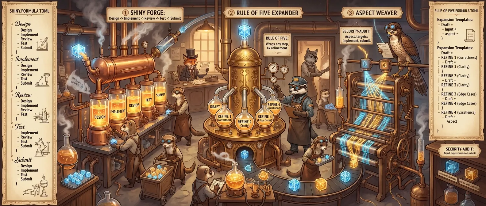

И наконец, мне нужно было слово, чтобы обозначить "молекуляризованную работу" - работу в форме, которую агенты могут брать и выполнять по шагу за раз. Это работа, которую вы можете компоновать вместе, молекулы, связывающиеся с другими молекулами, и вы можете настроить зависимости для всего гигантского проекта заранее, и заставить Gas Town роиться над ним целые выходные, без присмотра, если вы достаточно смелы.

Термин для большого моря рабочих молекул, всей работы в мире, - "бензак" (guzzoline), хотя мы не часто используем его в документации. Это просто идиома Gas Town, вроде War Rig, который является вкладом данного Рига в межриговый Конвой. Вы услышите это время от времени, но это не большая часть повседневного именования.

**Недетерминированная идемпотентность**

Gas Town работает по принципу, который я называю Недетерминированной идемпотентностью, или NDI. Это похоже на детерминированное, надежное воспроизведение Temporal, но Gas Town достигает своей надежности и гарантированного выполнения с помощью совершенно другого механизма.

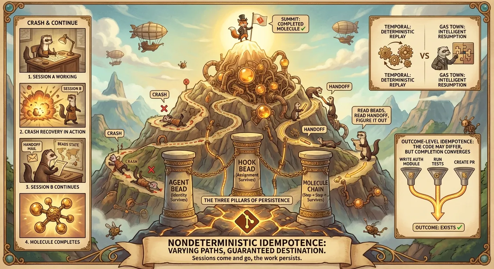

В Gas Town, работающем на стеке MEOW, вся работа выражается как молекулы. В этом есть немного алгебры, которую я открыл за последние две недели. Молекулы - это рабочие процессы. Они могут иметь сложные формы, и циклы, и шлюзы, и на самом деле они полны по Тьюрингу. И каждый шаг рабочего процесса выполняется сверхразумным ИИ.

Поскольку ИИ действительно хороши в следовании спискам TODO и критериям приемки, они надежны в следовании молекулам. Они понимают идею GUPP, и они понимают, что бюрократия по отметке задач, какими бы тривиальными они ни были, обновляет живую ленту активности. Этого рассуждения достаточно, чтобы они гудели и оставались на правильном пути, пока они это делают. Им не становится "скучно", и они гораздо реже совершают ошибки, потому что они не управляют своим собственным списком TODO (за исключением одного небольшого шага).

Это означает, что молекулярные рабочие процессы надежны. Если молекула находится на крючке агента, то:

1.  Агент постоянен: Bead, подкрепленный Git. Сессии приходят и уходят; агенты остаются.
2.  Крючок постоянен, также Bead, подкрепленный Git.
3.  Молекула постоянна - цепочка Beads, также в Git.

Поэтому не имеет значения, если Claude Code упадет или у него закончится контекст. Как только запустится другая сессия для этой роли агента, она немедленно начнет работать над этим шагом в молекуле (через GUPP или когда ее подтолкнет один из патрульных агентов). Если она обнаружит, что упала в середине последнего шага, ничего страшного, она выяснит правильное исправление, выполнит его и двинется дальше.

Так что даже если путь полностью недетерминирован, _результат_ - рабочий процесс, который вы хотели запустить - в конечном итоге завершается, "гарантированно", пока вы продолжаете бросать на него агентов. Агент может даже совершать ошибки по пути, но может самоисправляться, потому что критерии приемки молекулы, предположительно, хорошо специфицированы тем, кто проектировал молекулу.

Существует масса граничных случаев. Это описание NDI упрощено. Gas Town не является заменой Temporal. Спросите своего врача, подходит ли вам Gas Town. Но Gas Town действительно предоставляет гарантии рабочего процесса, которые вполне достаточно хороши для инструмента разработчика! Если вы - это я!

**Огоньки (Wisps): Эфемерные Beads Оркестрации**

Есть еще несколько уголков нашего учебника, которые нам, вероятно, следует затронуть. Большую часть времени вам все равно на это, вам важно, чтобы конвои запускались и завершались, и смотреть на ваши ленты активности и дашборды. Но молекулярная "химия" Gas Town имеет много богатых уголков, которые активно используются в оркестрации.

Одним из ключевых изобретений масштабирования от 21 декабря были Огоньки (Wisps), которые являются эфемерными Beads. Они находятся в базе данных, получают хеш-ID и действуют как обычные Beads. Но они не записываются в файл JSONL и, следовательно, не сохраняются в Git. В конце своего выполнения Огоньки "сжигаются" (уничтожаются). Опционально их можно сжать в однострочное резюме/дайджест, который коммитится в git.

Огоньки важны для высокоскоростных рабочих процессов оркестрации. Они являются паровой фазой материи для работы Gas Town. Все патрульные агенты - НПЗ, Свидетель, Дьякон, Хорьки - создают молекулы-огоньки для каждого запуска патруля или рабочего процесса. Они гарантируют, что рабочие процессы завершаются транзакционно, но без загрязнения Git шумом оркестрации.

**Патрули**

Патрули - это эфемерные (wisp) рабочие процессы, которые работают для Патрульных Работников, в частности НПЗ, Свидетеля и Дьякона.

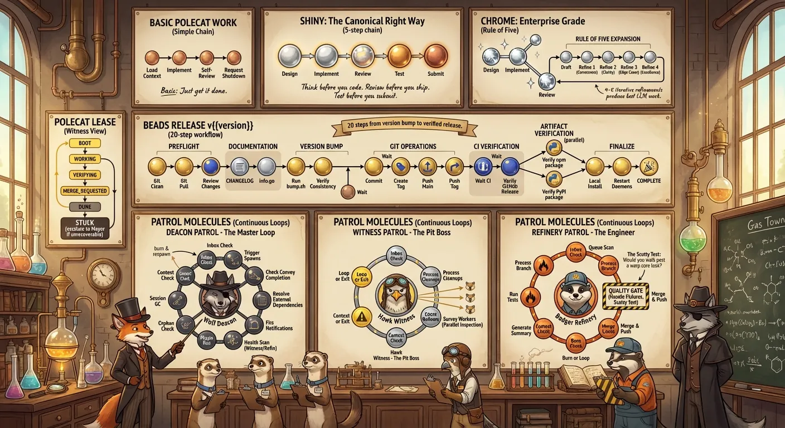

Патруль - это эфемерный (wisp) рабочий процесс, который агент запускает в цикле. У патрулей есть экспоненциальная отсрочка (backoff): агент будет постепенно засыпать, если не найдет работы в своих шагах патрулирования, ожидая все дольше и дольше, чтобы начать следующий патруль. Любая изменяющая команда `gt` или `bd` разбудит город, или вы можете сделать это сами с помощью команды `gt`, запуская отдельных работников, группы, риг или весь город.

Патруль НПЗ довольно прост. У него есть несколько предварительных шагов для очистки рабочего пространства, затем он обрабатывает Очередь слияния, пока она не опустеет, или пока ему не понадобится переработать сессию. У него есть несколько пост-полетных шагов в молекуле, когда он готов передать управление. Я готовлюсь добавить плагины в патруль НПЗ, но их там пока нет. Когда я их добавлю, вы сможете добавлять плагины, которые копаются в MQ и пытаются упорядочить ее разумно, и связать бэкенд Gas Town с другими системами.

Патруль Свидетеля немного сложнее. Он должен проверять благополучие хорьков и нефтеперерабатывающих заводов (Refineries). Он также заглядывает к Дьякону, просто чтобы убедиться, что он не застрял. И Свидетель запускает плагины уровня Рига.

Патруль Дьякона имеет много важных обязанностей. Он запускает плагины уровня Города, которые могут делать такие вещи, как предоставление совершенно новых UI или возможностей. Дьякон также участвует в протоколе для `gt handoff` и переработке сессий агентов, и обеспечении правильной очистки некоторых работников. Патруль Дьякона стал достаточно сложным, поэтому я добавил Псов в качестве помощников, личную команду Дьякона. Теперь ему предписано передавать сложную работу и расследования Псам, чтобы длительные шаги патрулирования не мешали основной системе событий города, которая является кооперативной и основанной на почте.

**Плагины Gas Town**

Gas Town определяет плагин как "скоординированное или запланированное внимание от агента". Работники Gas Town запускают рабочие процессы (часто в циклах патрулирования), и любой рабочий процесс может содержать любое количество шагов "запустить плагины".

Патруль Дьякона Gas Town запускает плагины уровня Города, и они теперь запускаются с Псами, так что они могут работать практически неограниченное время. У нас есть некоторая поддержка таймеров и колбэков, но в основном это хуки жизненного цикла. Я еще не вложил много дизайнерской мысли в эту подсистему, так что если вы хотите начать использовать систему плагинов, дайте мне знать, и мы можем разобраться.

Я планирую реализовать большое количество дополнительных функций в Gas Town как плагины. Они просто не попали в запуск v1. Они, вероятно, окажутся формулами в Mol Mall.

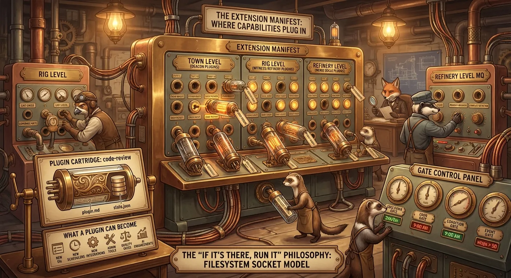

🚚 **Конвои** 🚚

ОК, фух. Вы отлично справились. Мы покрыли много теории, и это была особенно трудная теория, потому что это куча дерьма, которое я вытащил из своей задницы за последние 3 недели, и я назвал это в честь барсуков и прочего. Но в этом есть своего рода элегантная последовательность и связность. Оркестрация рабочих процессов, основанная на маленьких желтых стикерах в плоскости данных Git, действующих как узлы графа в море связанной работы.

Фу! Никому не интересно, я знаю. Вы хотите делать дела, сверхчеловечески быстро, ограниченные только скоростью пожирания токенов. Давайте поговорим о том, как.

Все в Gas Town, вся работа, сворачивается в Конвой.

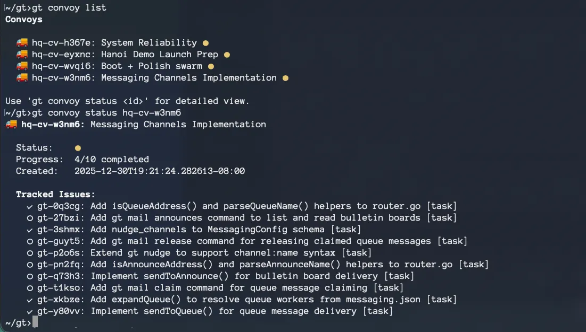

Конвой - это система тикетов или нарядов на работу в Gas Town.

Конвой - это специальный bead, который оборачивает кучу работы в единицу, которую вы отслеживаете для доставки. Он не использует структуру Epic, потому что отслеживаемые задачи в Конвое не являются его детьми - у большинства из них уже есть другой родитель.

Фундаментальный примитив для разбрасывания работы в Gas Town - это `gt sling`. Если я скажу Мэру: "Наши сессии tmux показывают неправильное количество ригов в строке состояния - зарегистрируй это и швырни", Мэр зарегистрирует bead для проблемы, а затем `gt sling` (швырнет) его хорьку, псу или команде, в зависимости от того, как он чувствует себя в роли фабричного шимпанзе в этот день.

Реальный пример: я часто говорю своей команде Beads швырнуть молекулу релиза хорьку. Хорек пройдет через 20-шаговый процесс релиза, закончит его, а затем я получу уведомление, что Конвой приземлился/завершился.

Сбивает с толку слышать, что "задача `wy-a7je4` только что завершилась". Даже если вы видите заголовок, он может не отражать более крупный блок работы, частью которого была эта задача. Поэтому теперь мы оборачиваем каждую единицу швырнутой работы, от одиночного броска хорьку до большого роя, который кто-то запускает, Конвоем.

Конвои отображаются на дашборде, который становится лучше с каждым днем; есть TUI на базе Charmbracelet с расширяющимися деревьями для каждого конвоя, так что вы можете видеть его отдельные отслеживаемые задачи. UI и UX будут улучшаться. Это День 1 для Gas Town.

Конвои - это в основном фичи. Будь то очистка технического долга, или реальная фича, или исправление бага, каждый конвой - это единица тикетинга архитектуры нарядов на работу Gas Town. Они довольно новые (может быть, 3-4 дня?), но уже являются самым веселым способом работы.

Обратите внимание, что Конвой может быть "атакован" (обработан) несколькими роями до того, как он будет завершен. Рои - это эфемерные сессии агентов, берущие на себя постоянную работу. Тот, кто управляет Конвоем (например, Свидетель), будет продолжать перерабатывать хорьков и подталкивать их к задачам.

**Рабочий процесс Gas Town**

Самый фундаментальный рабочий процесс в Gas Town - это передача управления, `gt handoff`, или команда `/handoff`, или просто скажите "давай передадим управление". Ваш работник опционально отправит себе работу, затем перезапустит свою сессию прямо там, в tmux. Все ваши работники, которыми вы руководите - Мэр, ваша Команда, а иногда и другие - потребуют от вас сообщить им, что пора передавать управление.

Кроме этого, цикл разработки в Gas Town более или менее такой же, как и с Claude Code (и Beads), просто его больше. Вы получаете рои бесплатно (они стоят только денег), вы получаете приличные дашборды, вы получаете способ описывать рабочие процессы, и вы получаете почту и сообщения. Это... примерно все.

Я нашел tmux одновременно простым в использовании и шокирующе мощным, и я едва начал изучать все тонкости. Он дает мне все, что мне нужно: переключение на любого агента, сканирование того, что они все делают, циклическое переключение между различными группами связанных агентов. Это здорово.

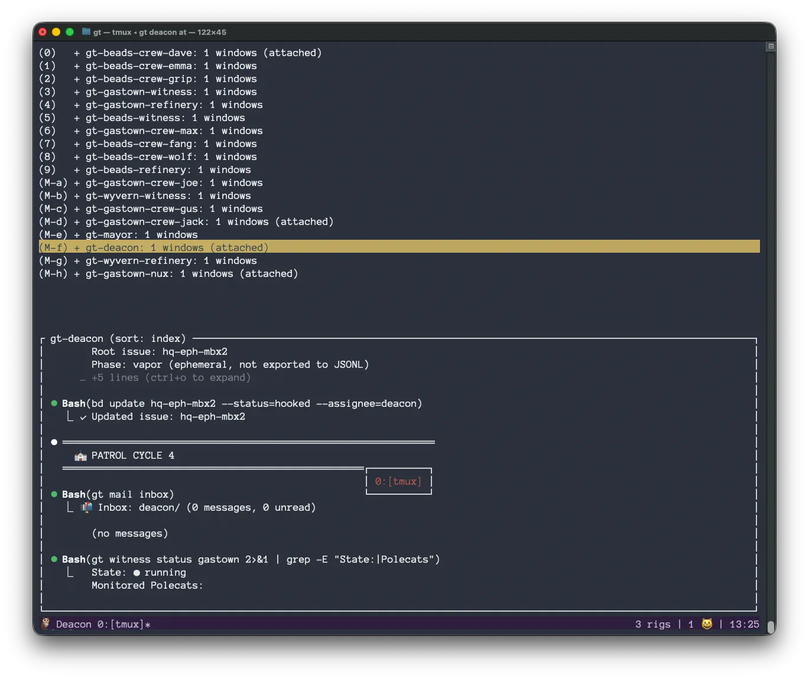

Я, конечно, с нетерпением жду UI на Emacs для Gas Town. И я уверен, что некоторые из вас с нетерпением ждут Web UI. Дерзайте!

Но tmux достаточно хорош. Вам не нужно учить много команд tmux, чтобы быть опытным. Я просто использую несколько:

- `C-b s` - список сессий, подглядывание за ними, переключение на одну
- `C-b b` - перемещение курсора назад (`C-b` во многих редакторах и оболочках). В tmux он просто идет назад медленнее. Небольшая плата!
- `C-b [` - войти в "режим копирования", который приостанавливает вывод и позволяет прокручивать (`ESC` для выхода)
- `C-b C-z C-z` - приостановить процесс и выйти в оболочку
- `C-b n/p` - циклически перейти к следующему работнику в группе (например, следующему члену Команды в риге)
- `C-b a` - вызывает просмотр ленты активности (моя конфигурация)

И это практически все! Клянусь, вам не нужно много tmux. Он не мешает вам и спасает вашу задницу большую часть времени. Он также позволяет работать удаленным облачным работникам (которых мы подключим через несколько дней), и он невероятно настраиваемый. Вы просто просите Claude Code сделать так, чтобы tmux работал лучше для вас, и он это сделает. Он сделает любой вид, который вы хотите, переназначит клавиши, как вам нравится, сделает пользовательские всплывающие окна, что угодно. Это удивительно, почти как маленький Emacs.

**Планирование в Gas Town**

Gas Town нужно много топлива. Он и потребляет, и производит бензак, или молекулы работы. Помимо простого удержания Gas Town на рельсах, вероятно, самая сложная проблема - это держать его накормленным. Он пережевывает планы реализации так быстро, что вам приходится делать МНОГО проектирования и планирования, чтобы двигатель был сыт.

Со стороны потребления вы скармливаете Gas Town эпики, задачи и молекулы (сконструированные рабочие процессы). Он пережевывает их, порождая, ну... Я стараюсь держать количество работников до 30 прямо сейчас, потому что я еще не реализовал удаленных работников на гиперскейлерах (скоро!), и обычно у меня будет только дюжина или около того активных, если только я не нажимаю _действительно_ сильно на Мэра и Свидетелей.

Но вау. С 12-30 работниками вы можете сжечь огромные бэклоги работы за один присест, даже если вы используете рабочие процессы хорьков "shiny" или "chrome", которые выполняют дополнительные шаги по проверке кода и тестированию (и, следовательно, занимают больше времени).

Со стороны производства, ну, вы можете использовать свой собственный инструмент планирования, например Spec Kit или BMAD, а затем, как только ваш план будет готов, попросить агента преобразовать его в эпики Beads. Если план достаточно большой, вы можете захотеть создать рой и создать эпики для разных частей плана в большом конвое.

Вы можете использовать формулы для генерации работы. Если вы хотите, чтобы каждая часть работы по кодингу (или работа по дизайну, или работа по UX) проходила через определенный шаблон или рабочий процесс, вы можете определить это как молекулу, а затем "обернуть" или скомпоновать базовую работу с вашим шаблоном оркестрации.

Я реализовал формулу для "Правила пяти" Джеффри Эмануэля, которое заключается в наблюдении, что если вы заставите LLM проверить что-то пять раз, с разными областями фокусировки каждый раз, это генерирует превосходные результаты и артефакты. Так что вы можете взять любой рабочий процесс, приготовить его с Правилом пяти, и каждый шаг будет проверен 4 раза (реализация считается первым обзором).

Это может генерировать БОЛЬШИЕ рабочие процессы, выполнение которых может занять у вас много часов или дней, особенно если вы ограничиваете количество хорьков, чтобы контролировать свои расходы или сжигание токенов. Но приятная вещь в Gas Town заключается в том, что как только работа сгенерирована, вы можете повесить ее на крючок и сжечь ее автономно.

## Сравнение с Kubernetes

Вот сравнение с Kubernetes, которое я обещал. Не стесняйтесь пропустить его.

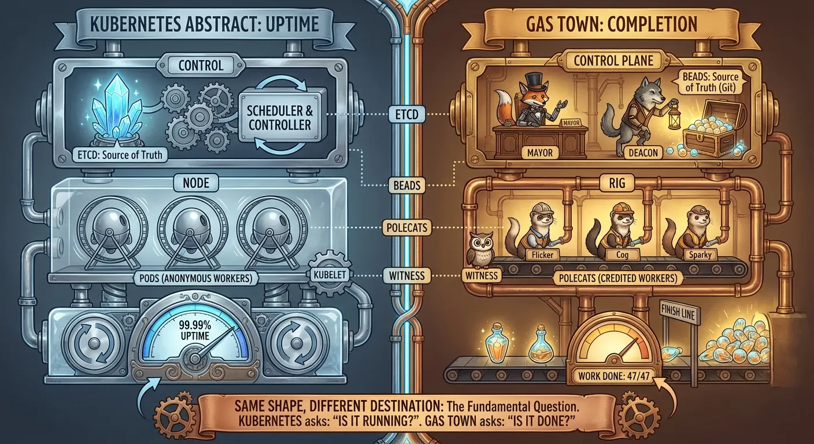

Gas Town, возможно, немного похож на Kubernetes, непреднамеренно. Обе системы координируют ненадежных работников для достижения цели. У обоих есть плоскость управления (Мэр/Дьякон против kube-scheduler/controller-manager), наблюдающая за узлами выполнения (Риги против Узлов), каждый с локальным агентом (Свидетель против kubelet), контролирующим эфемерных работников (Хорьки против Подов). Оба используют источник истины (Beads против etcd), с которым сверяется вся система. По-видимому, это естественные формы, которые возникают, когда вам нужно пасти котов в масштабе.

Большая разница в том, что Kubernetes спрашивает: "Оно работает?", в то время как Gas Town спрашивает: "Оно готово?". K8s оптимизирует аптайм - держать N реплик живыми, перезапускать упавшие поды, поддерживать желаемое состояние вечно. Gas Town оптимизирует завершение - закончить эту работу, приземлить конвой, затем уничтожить работника и двигаться дальше. Поды K8s - это анонимный скот; хорьки Gas Town - это работники с репутацией, чьи завершения накапливаются в цепочках резюме, а _сессии_ - это скот. K8s сверяет с непрерывным желаемым состоянием; Gas Town движется к терминальной цели. Похожая форма двигателя, радикально разный пункт назначения.

**Вещи, на которые у меня просто не хватило времени**

Я хотел запустить Gas Town в Рождество, и не успел. Он на самом деле не начал работать, и я имею в виду _летать_, как я себе представлял, до 20:00 29 декабря. Он летал 2 часа, прежде чем я заметил. Я разговаривал с Мэром, жаловался на вещи, и тут исправления начали приземляться вокруг меня, и я понял, что я просто формирую все это, разговаривая. Конвои текли и приземлялись, работа регистрировалась и проверялась... это то, к чему я стремился месяцами. И я заставил это работать только 2 дня назад. Достаточно хорошо для запуска!

Вот что не попало в новогодний релиз.

- **Федерация** - даже в Python Gas Town была поддержка удаленных работников на GCP. Мне нужно спроектировать поддержку федерации, как для расширения возможностей вашего собственного города, так и для связывания и совместного использования работы с другими человеческими городами.
- **GUI** - У меня даже не было времени сделать UI на Emacs, не говоря уже о хорошем веб-UI. Но кто-то должен обязательно сделать его, а если нет, я в конечном итоге доберусь до этого.
- **Плагины** - У меня не было возможности реализовать какую-либо функциональность как плагины на шагах молекулы, но вся инфраструктура на месте.
- **Mol Mall** - маркетплейс и биржа для молекул, которые определяют и формируют рабочие нагрузки.
- **Hanoi/MAKER** - Я хотел запустить огонек на миллион шагов, но у меня не хватило времени.

Тем не менее, я довольно доволен тем, что _действительно_ вошло:

- **Само-передачи (Self-handoffs)** работают бесшовно - основной рабочий процесс внутреннего цикла Gas Town
- **Швыряние (Slinging)** работает, **конвои** работают
- Весь **стек MEOW** работает
- **Патрули Дьякона, Свидетеля и НПЗ** все работают автоматически
- **Команда** великолепна, намного лучше, чем сырые экземпляры Claude Code
- **UI tmux** работает удивительно хорошо, лучше, чем я бы предположил.

Плюс мы получили некоторые крутые фичи, такие как `gt seance`. В целом, хорошие 17 дней работы. Пока что.

## Настраивайтесь на следующий раз

Я так же измотан, как и вы. Было весело болтать, но мне нужно возвращаться в Gas Town.

Там есть еще. Это только проба. Я буду публиковать больше постов, видео и контента вокруг Gas Town. Если вы хотите внести свой вклад, и вы достаточно сумасшедшие, чтобы запрыгнуть в этот вагон, присоединяйтесь к сообществу и начинайте присылать обсуждения, GH Issues и PR!

Просто помните Золотые Правила:

- Не используйте Gas Town, если вы не жонглируете как минимум пятью Claude Code одновременно, ежедневно.
- Не используйте Gas Town, если вас волнуют деньги.
- Не используйте Gas Town, если вы выше 4 футов. Я хочу возвышаться впечатляюще на встречах, как Саурон.
- Не используйте Gas Town.

Gas Town всего 17 дней, по крайней мере этой версии, "порту" Python Gas Town на Go. Прошлые 2 недели видели изобретение и реализацию всего стека MEOW, огоньков, патрулей, конвоев, агентов и личностей как beads, роев как beads, ролей как beads, инноваций "подача как сигнал", и добавление НПЗ, Дьякона и Псов (со времен Python Gas Town). И кучу всего другого вдобавок.

17 дней, 75 тысяч строк кода, 2000 коммитов. Он наконец оторвался от земли (GUPP заработал) всего 2 дня назад. Этот год обещает быть интересным.

Я поделился Gas Town с Anthropic в ноябре, по крайней мере, широким наброском. Думаю, я их напугал. Я никогда не видел, чтобы компания становилась такой консервативной так быстро. Но они подумали, что _Beads_ был слишком самоуверенным, так что я боюсь, что Gas Town будет уже явным перебором, как говорится.

Но я уже начал получать странные предложения от людей, разнюхивающих ранние слухи о Gas Town, заплатить мне, чтобы я сидел дома и был собой: я могу работать над Beads и Gas Town, и просто должен написать хороший пост или сходить на конференцию или семинар время от времени. У меня есть _три_ таких предложения прямо сейчас. Это почти сюрреалистично.

Это напоминает мне аниме, пару серий которого я видел на Crunchyroll, где эта ленивая панда не может найти работу и жалуется на это весь день своему другу белому медведю, у которого есть кафе. Затем однажды он посещает зоопарк и обнаруживает, что у них есть объявление о вакансии на выставке панд. Так что он подает заявку, и получает работу, и сидит, изображая панду в течение дня, а затем отправляется домой ночью. Это было тааак абсурдно.

Я - эта панда.

Я не вернусь на работу, пока не найду компанию и команду, которые "врубаются". Я устал ходить и рассказывать людям будущее, просто размахивая им прямо перед их лицами, и не быть услышанным.

Я лучше буду сидеть дома и создавать будущее своими собственными руками. У меня на самом деле есть шесть видов бамбука на моем участке. Я уже панда, проживающая лучшие моменты своей жизни.

Если вы хотите помочь мне, свяжитесь со мной! И миллион благодарностей всем невероятным контрибьюторам Beads!

Увидимся в следующий раз, с большим количеством контента о [Gas Town](https://github.com/steveyegge/gastown). С Новым Годом!

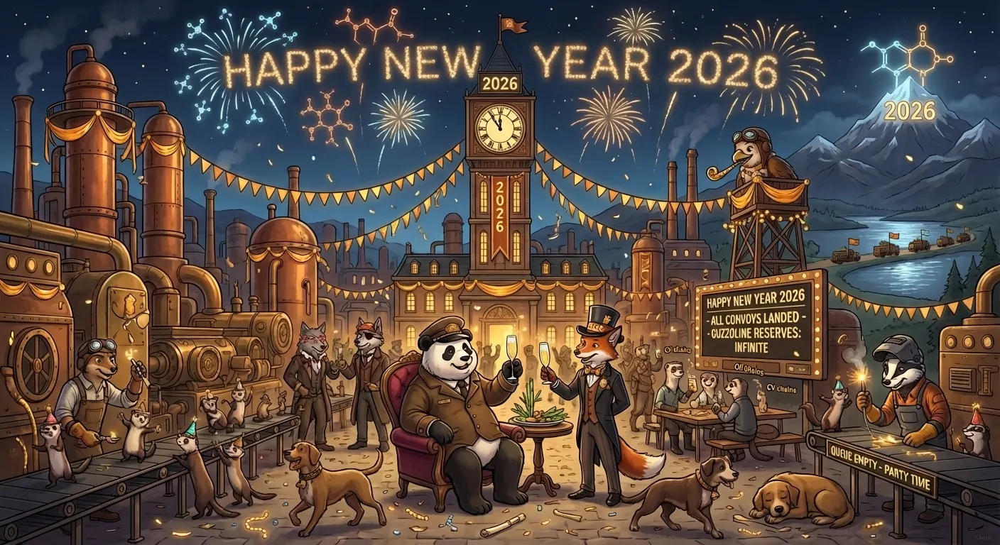

---

## Об авторе

[Стив Йегге](https://github.com/steveyegge) - бывший сотрудник Geoworks, Amazon, Google, Grab и Sourcegraph, имеющий более 30 лет опыта работы в технологической индустрии и 40 лет опыта программирования в общей сложности.
